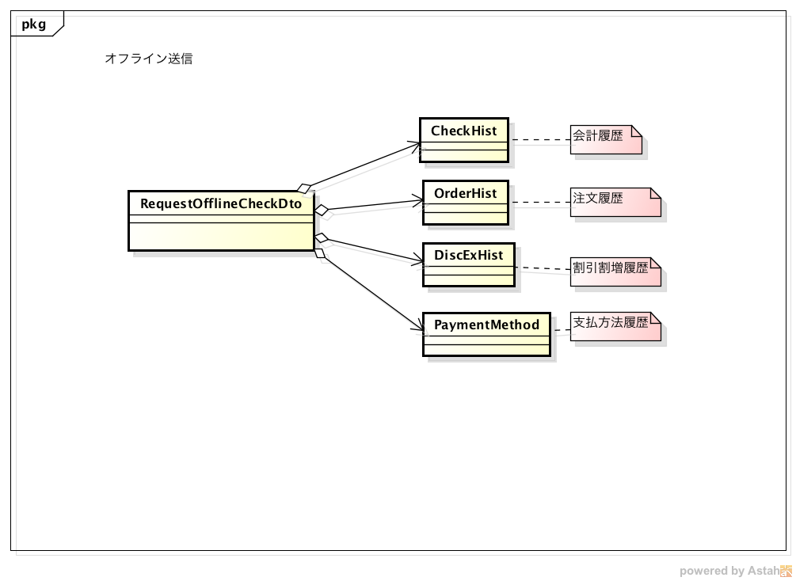

# デザインパターン

# 概要
見てきたor 使ってきたデザインパターン
iOSアプリ開発での使用例(GoF切り口)

## メリット
設計における解決策の再利用とエンジニア間の共通用語の確立によるコミュニケーションの円滑化が図れる。

## 1. 生成に関するパターン
### Builder　


オフライン会計データ送信に於けるmodelオブジェクトからJSONオブジェクト生成



### Singleton
ファイル管理クラス[FileManager](https://developer.apple.com/documentation/foundation/filemanager)
 [UserDefaults](https://developer.apple.com/documentation/tvmljs/userdefaults)

## 2. 構造に関するパターン
### Adapter
WrapperにしてI/Fを既存のものに合わせる(依存関係をカプセル化)で使用 GoogleAnalytics, FabricなどのTracking詳細をカプセル化


```swift
struct GoogleAnalytcis {
    static let shared = GoogleAnalytcis()
    func trackerWithTrackingId(_ key: String) {}
}

struct Analytics {
    static func createTracker(key: String) {
        GoogleAnalytcis.shared.trackerWithTrackingId(key)
    }
}

Analytics.createTracker(key: "myTracker")
```

### Decorator
画像生成(レシート[カスタマ、オーダー]、ジャーナル)で使用
会計情報に対して、税金情報、割引情報、店舗情報、チップ、クレジットカード情報(カードNo. 会社、サイン)
返金


```swift
class PrintImage {
    func renderImage() {
        print("image")
    }
}
class VoucherImage: PrintImage {
    override func renderImage() {
        for idx in 0..<10 {
            print("item: \(idx)")
        }
    }
}

class DecolateImage: PrintImage {
    let image: PrintImage
    init(image: PrintImage) {
        self.image = image
    }

    override func renderImage() {
        print("###########")
        image.renderImage()
        print("###########")

    }
}

PaymentImage(image:
    StoreInfoImage(image:
        DecolateImage(image:
            BodyImage()))).renderImage()
```
ジャーナル:　http://chigai.lance3.net/z0319.html

## 3. 振る舞いに関するパターン

### [Strategy](https://ja.wikipedia.org/wiki/Strategy_パターン#/media/File:StrategyPatternClassDiagram.svg)
1. レジアプリ　税計算、割引按分計算（％割引、＄割引）
2. 相続税計算アプリ　土地評価額計算（路線価方式、倍率方式）


```swift
class CalcTax {
    func taxAmount(subtotal: Double) -> Double {
        return 0.0
    }
}

class CalcUSTax: CalcTax {
    override func taxAmount(subtotal: Double) -> Double {
        return 0.08875 * subtotal
    }
}

class CalcJPTax: CalcTax {
    override func taxAmount(subtotal: Double) -> Double {
        return 0.08 * subtotal
    }
}

enum Country {
    case us, jp
    func calcTax() -> CalcTax {
        switch self {
        case .us:
            return CalcUSTax()
        case .jp:
            return CalcJPTax()
        }
    }
}

let calcUsTax = Country.us.calcTax()
let calcJpTax = Country.jp.calcTax()

[calcUsTax, calcJpTax]
    .map { $0.taxAmount(subtotal: 100) }
```

# 参考
## サイト
[java プログラマのためのデザインパターン入門](http://objectclub.jp/technicaldoc/pattern/DPforJavaProgrammers)
http://monopocket.jp/todo/objective-c-design-pattern/
## 書籍
1. [増補改訂版Java言語で学ぶデザインパターン入門](https://www.amazon.co.jp/%E5%A2%97%E8%A3%9C%E6%94%B9%E8%A8%82%E7%89%88Java%E8%A8%80%E8%AA%9E%E3%81%A7%E5%AD%A6%E3%81%B6%E3%83%87%E3%82%B6%E3%82%A4%E3%83%B3%E3%83%91%E3%82%BF%E3%83%BC%E3%83%B3%E5%85%A5%E9%96%80-%E7%B5%90%E5%9F%8E-%E6%B5%A9/dp/4797327030)
2. [オブジェクト指向のこころ](https://www.amazon.co.jp/オブジェクト指向のこころ-SOFTWARE-PATTERNS-アラン-シャロウェイ/dp/4621066048/ref=sr_1_1?s=books&ie=UTF8&qid=1502236388&sr=1-1&keywords=オブジェクト指向のこころ)
3. [Dynamic Objective-c](https://www.amazon.co.jp/Dynamic-Objective-C-木下-誠/dp/4861006414/ref=sr_1_1?s=books&ie=UTF8&qid=1502236924&sr=1-1&keywords=ダイナミックObjective-c)
